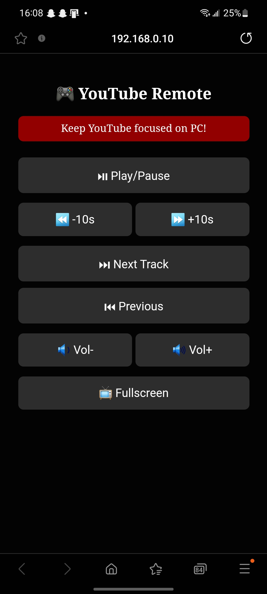
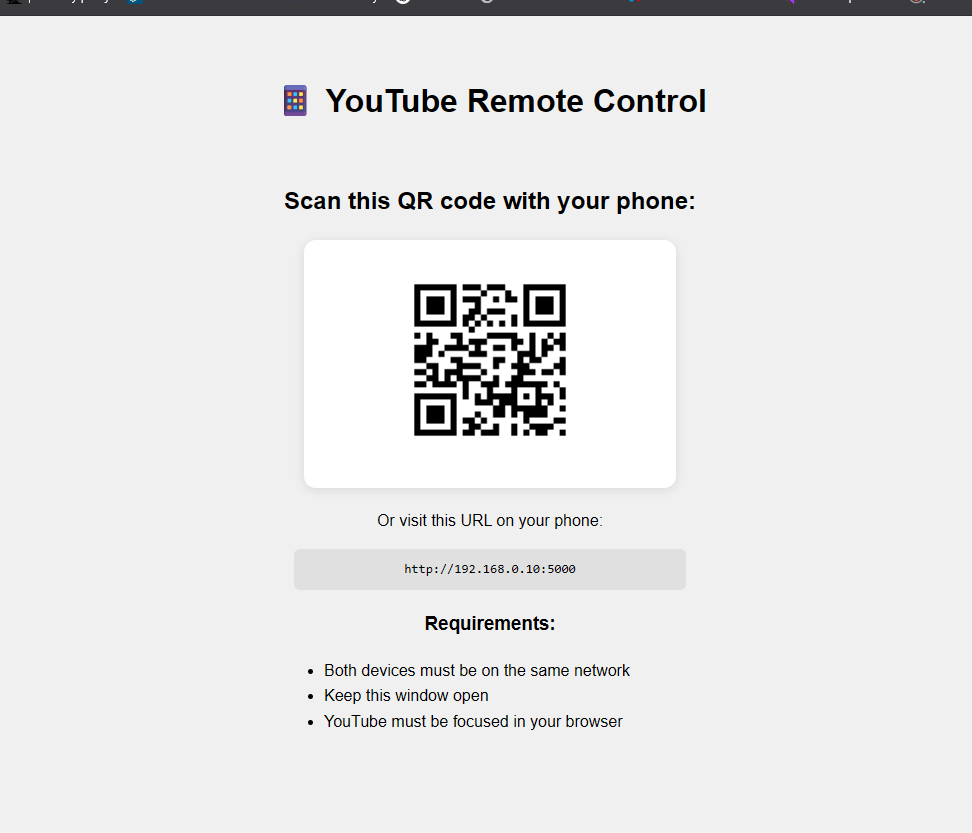

# YouTube Remote Control 🎮

A Flask-based web application to control YouTube playback on your PC from a mobile device. Uses QR code for easy connection and keyboard shortcuts for seamless control.

## Context of Use 🎧  
Perfect for situations where your computer is connected to speakers/sound system but physically inconvenient to access:
- Controlling music during house cleaning/cooking
- Managing playback in a home theater setup
- Adjusting volume during parties/gatherings
- Skipping ads while working out (Comming soon, i use brave, wich block ads personnally)
- Managing YouTube content during presentations

Simply keep your computer's browser focused on YouTube, and control everything from your phone within the same WiFi network!

## Features ✨
<br><br>
- Phone UI

- PC UI


## Requirements 📋
- Python 3.7+
- YouTube open in browser (Chrome/Firefox/Edge)
- Devices on the same local network

## Installation 🛠️
1. Clone the repository:
   ```bash
   git clone https://github.com/KeparYTbcc/Yt-pc-remote.git
   cd youtube-remote
   ```
2. Install dependencies:
   ```bash
   pip install -r requirements.txt
   ```

## Usage 🚀
1. **Run the application**:
   ```bash
   python main.py
   ```
2. **On your PC**:  
   - A browser window will open automatically showing a QR code
   - Keep YouTube focused in your browser

3. **On your mobile device**:  
   - Scan the QR code or visit the displayed URL
   - Use the control interface (PIN: `1234` by default)

## Security 🔒
**Change the default PIN** before deployment:
1. Open `main.py`
2. Modify this line:
   ```python
   PIN = "1234"  # Change this PIN
   ```

## Important Notes ⚠️
- 🖥️ YouTube must be the **focused tab** in your browser
- 📱 Mobile device and PC must be on the **same network**
- 🔥 Add firewall exception for port 5000 if needed

## Disclaimer ⚖️
This project is for educational purposes only. Not affiliated with YouTube or Google. Ensure you have permission to control the target device.
